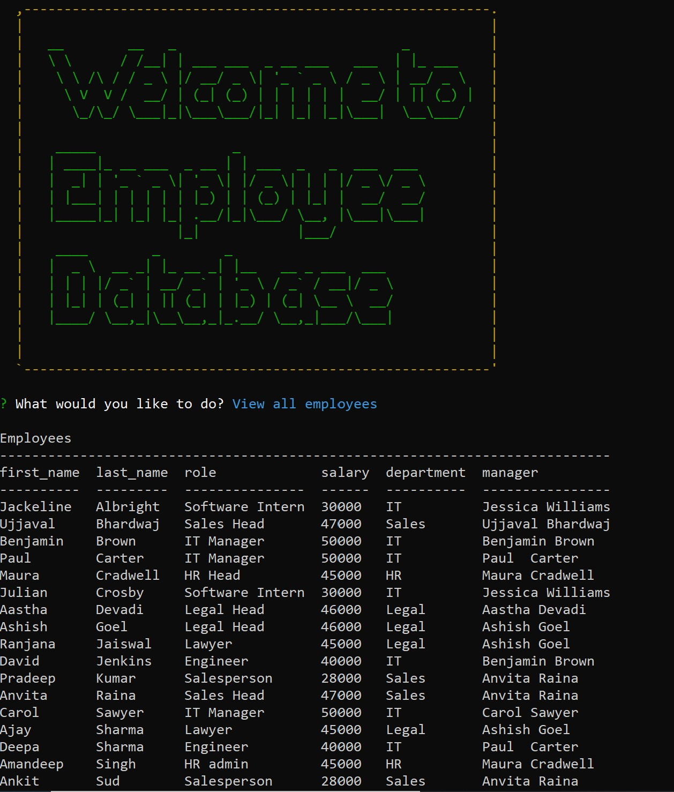

# Employee-Tracker

## Description

Employee tracker is a CLI application for managing a company's employees using node, inquirer, and MySQL.

## Key Learning:

1. Async Javascript.
2. MySQL
3. Node.js
4. NPM packages console.table
5. Usage of Github (uploading and publishing on github).

## Table of Contents

- [Installation](#Installation)
- [Usage](#Usage)
- [License](#License)
- [Contributors](#Contributors)
- [Tests](#Tests)
- [Technologies](#Technologies)
- [Questions](#Questions)

## Installation

- Install MySQL on your machine.
- Clone project into a local directory and cd into the project directory.
- On console run npm install. It will install all project dependencies.
- In the projects root directory, you will need to create a file named ".env", to hold your MySQL password safely.
- Run the command node index.js and interact with database.

## Usage

- Homepage Screenshot

  

- Mockup

  [Watch Video](https://youtu.be/Zc6SIAYvGbo)

## License

- The application is covered under the license MIT. For more Info please visit [License Info](https://opensource.org/licenses/MIT)

## Contributors

- None

## Tests

- None

## Technologies

- Node.js
- inqurier
- MySQL

## Questions

If you have any questions about project you can either contact me or visit my github profile.

Link to my Github: [Github](https://github.com/gunjanb)

Email address :[gunjanbhargava2021@gmail.com](mailto:gunjanbhargava2021@gmail.com)
